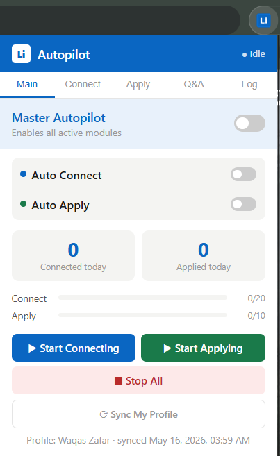
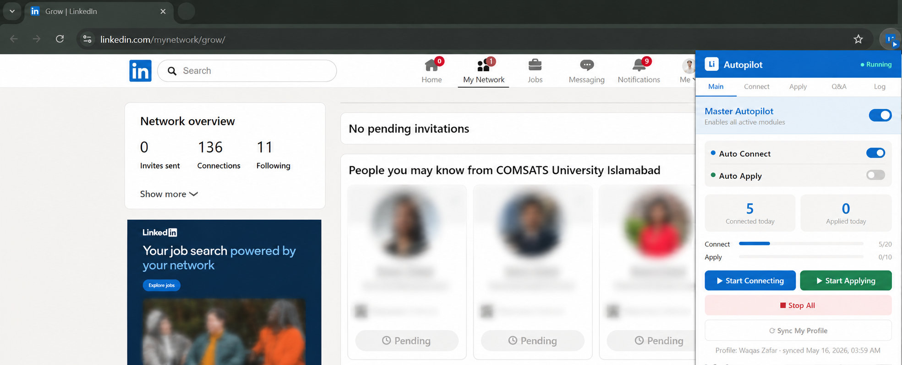
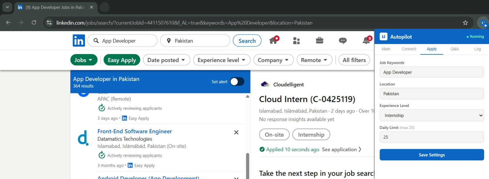
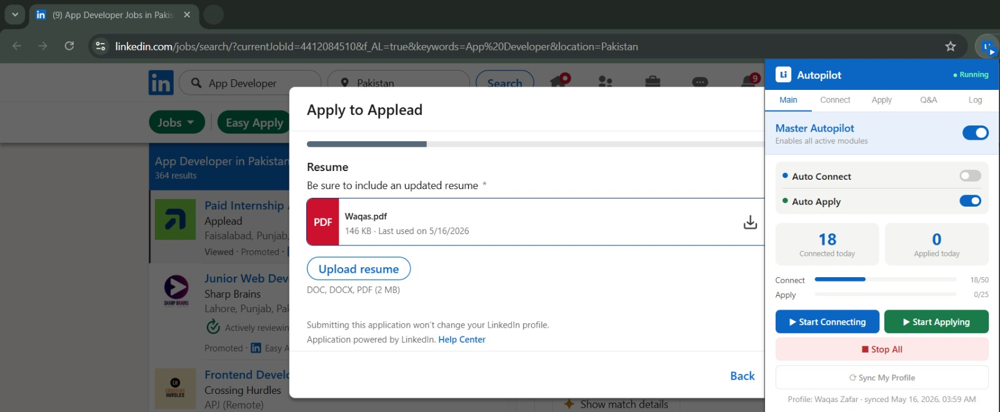

# Li-Autopilot

`Li-Autopilot` is a Chrome Extension for LinkedIn that automates two repetitive workflows:

- sending connection requests from LinkedIn's `My Network` suggestions page
- submitting jobs through LinkedIn `Easy Apply`

It is built as a pure client-side Chrome Extension using Manifest V3. There is no backend, no hosted database, and no external API dependency.

## What It Does

### Auto Connect

- opens `https://www.linkedin.com/mynetwork/grow/`
- finds visible `Connect` buttons
- sends connection requests up to your daily limit
- optionally adds a personalized note
- logs activity and tracks daily counters

### Auto Apply

- opens LinkedIn Jobs search with your saved keywords, location, and experience level
- selects Easy Apply jobs
- opens the Easy Apply modal
- leaves already-filled fields untouched
- fills only required empty fields using your saved Q&A answers and synced profile data
- clicks `Next`, `Review`, and `Submit application` step by step
- unchecks the `Follow company` checkbox before submit
- moves to the next job until your daily limit is reached

### Main Popup



### Auto Connect Running



### Easy Apply Form Step



### Easy Apply Review / Submit Step



## Why This Exists

LinkedIn workflows like connection outreach and Easy Apply can involve a lot of repeated clicking. This extension is meant to reduce that manual repetition while keeping the workflow local to your browser.

## How It Works

The extension has three main parts:

1. `popup/`
   The UI where you configure limits, job search settings, Q&A answers, and start or stop automation.

2. `background/service-worker.js`
   The background orchestrator that opens the right LinkedIn pages and routes commands into LinkedIn tabs.

3. `content/`
   The LinkedIn page automation logic:
   - `utils.js` shared helpers
   - `profile-scraper.js` syncs your own LinkedIn profile
   - `connect.js` handles Connect automation
   - `apply.js` handles Easy Apply automation

## Tech Stack

- Chrome Extension
- Manifest V3
- Service Worker
- Content Scripts
- Vanilla JavaScript
- `chrome.storage.local`

## Setup

### 1. Download the project

Download the folder li-autopilot to your machine.

### 2. Load it into Chrome

1. Open `chrome://extensions/`
2. Enable `Developer mode`
3. Click `Load unpacked`
4. Select the `li-autopilot` folder (make sure it's unzipped)
5. Pin the extension to your Chrome toolbar

## First-Time Configuration

### 1. Sync Your Profile

Click `Sync My Profile` in the popup.

This opens your LinkedIn profile and stores reusable information locally, including:

- name
- headline
- location
- experience
- education
- skills
- estimated years of experience

This data is later used for Easy Apply form filling and optional personalized note handling.

### 2. Configure Auto Connect

In the `Connect` tab:

- set your daily connect limit
- optionally enable a personalized note
- save settings

### 3. Configure Auto Apply

In the `Apply` tab:

- set job keywords
- set location
- choose experience level
- set daily apply limit
- save settings

### 4. Fill Q&A Answers

In the `Q&A` tab, save answers for fields such as:

- phone
- city
- address
- state / province
- postal / ZIP code
- salary
- years of experience
- notice period
- visa / sponsorship
- relocation

These values are used when LinkedIn Easy Apply requires them.

## How To Use It

### Auto Connect

1. Turn on `Master Autopilot`
2. Enable `Auto Connect`
3. Click `Start Connecting`

The extension will:

- open LinkedIn's grow page
- scan visible suggestion cards
- click `Connect`
- respect your daily limit
- log actions in the `Log` tab

### Auto Apply

1. Turn on `Master Autopilot`
2. Enable `Auto Apply`
3. Click `Start Applying`

The extension will:

- open LinkedIn Jobs with your saved filters
- select Easy Apply jobs
- fill required empty fields only
- advance through modal steps
- review attached resume if applicable
- uncheck `Follow company`
- submit the application

# Data Storage and Privacy

## All extension data is stored locally in `chrome.storage.local` (C:\Users\<User Name>\AppData\Local\Google\Chrome\User Data\Default\Local Extension Settings\<extension-id>\)

That includes:

- your toggles and limits
- your Q&A answers
- your synced profile data
- activity logs
- daily counters

What this means:

## - no external server
## - no remote database
## - no analytics
## - no telemetry
## - no cloud sync added by this project

## If you use this extension, your project data remains inside your local Chrome profile unless you personally export or share it.

## Random Delay / Human Hesitation

The extension includes built-in delays between actions to mimic human hesitation and reduce spammy behavior.

Examples:

- small delays between clicks
- longer pauses after a few actions

These delays are mainly implemented through shared helpers in:

- [content/utils.js](li-autopilot/content/utils.js)

Used by:

- [content/connect.js](li-autopilot/content/connect.js)
- [content/apply.js](li-autopilot/content/apply.js)

## How Developers Can Reduce or Remove Delay

If you want faster behavior for development or testing, edit the delay logic.

### Option 1: Lower the delay range

In [content/connect.js](li-autopilot/content/connect.js) and [content/apply.js](li-autopilot/content/apply.js), reduce values passed to:

```js
await LiAP.randomDelay(min, max);
```

Example:

```js
await LiAP.randomDelay(2500, 7000);
```

can become:

```js
await LiAP.randomDelay(500, 1200);
```

### Option 2: Disable long reading pauses

In [content/utils.js](li-autopilot/content/utils.js), replace:

```js
LiAP.readingPause = async () => {
  const ms = Math.floor(Math.random() * 60000) + 30000;
  await LiAP.sleep(ms);
};
```

with:

```js
LiAP.readingPause = async () => {};
```

### Option 3: Disable random delays entirely

In [content/utils.js](li-autopilot/content/utils.js), replace:

```js
LiAP.randomDelay = async (min = 2000, max = 6000) => {
  const ms = Math.floor(Math.random() * (max - min + 1)) + min;
  await LiAP.sleep(ms);
  return ms;
};
```

with:

```js
LiAP.randomDelay = async () => 0;
```

## Project Structure

```text
li-autopilot/
├── manifest.json
├── background/
│   └── service-worker.js
├── content/
│   ├── utils.js
│   ├── profile-scraper.js
│   ├── connect.js
│   └── apply.js
├── popup/
│   ├── popup.html
│   ├── popup.css
│   └── popup.js
├── icons/
│   ├── icon16.png
│   ├── icon48.png
│   └── icon128.png
└── docs/
    ├── ARCHITECTURE.md
    ├── SCREENSHOTS.md
    └── images/
```

## Notes for Developers

- the extension is selector-driven, so LinkedIn DOM changes may require selector updates
- `connect.js` targets `linkedin.com/mynetwork/grow/`
- `apply.js` handles multi-step Easy Apply modals
- required fields are detected before fill attempts
- missing required answers are logged and skipped safely

# Disclaimer

## This project automates actions on LinkedIn. LinkedIn may limit, restrict, or disallow certain automated behavior under its Terms of Service or platform policies.

## Use this project carefully and responsibly.

Important points:

- keep daily limits conservative
- avoid aggressive or mass automation
- review your own use case before running at scale
- use at your own risk

# This repository is shared for educational and personal-use purposes.
